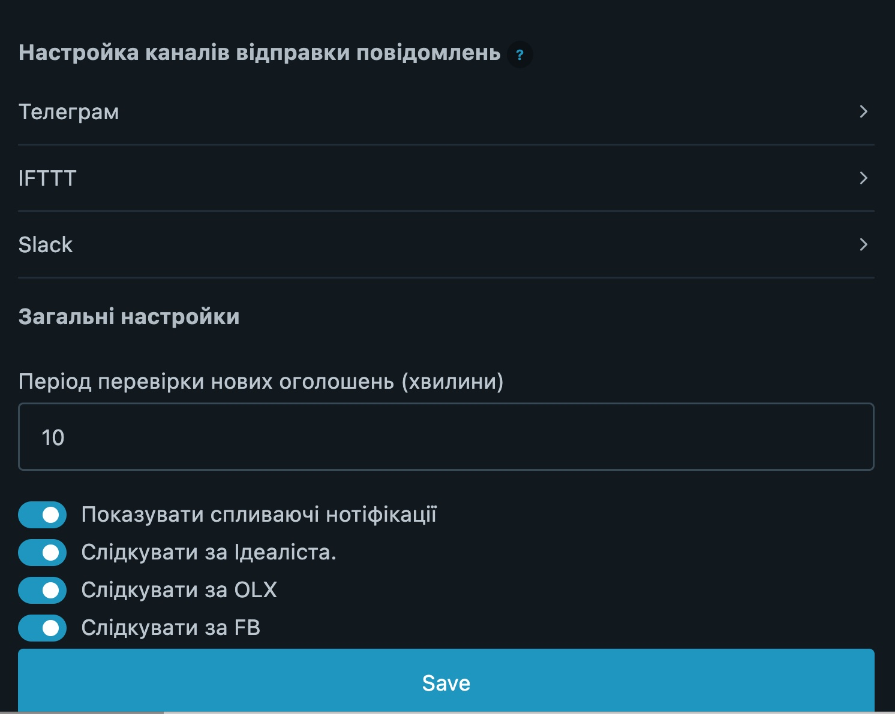

# PTRentNotifier
## Розширення браузера Chrome для слідкування за португальскими ресурсами з продажу/аренди нерухомості

### Проблема:

Кращі варіанти аренди уходять, ніби то гарячі пиріжки. Швидше дзвониш - менше бомжуєш. Оперативні обирають більш привабливі таймслоти для показу, та й людина, що постила обʼяву ще "в контексті" і з більшою ймовірністю думає про нерухомість, а не про бокал вина.

### Вирішення:

Браузерне розширення, що слідкує за відкритими у браузері сторінками пошуку, періодично перевіряючи чи зʼявились нові пропозиції. Як що знайшло, то шле нотіфікації.

### Встановлення

https://dev.to/ben/how-to-install-chrome-extensions-manually-from-github-1612

### Використання

1. Після вставновлення по кліку на іконці розширення треба змінити налаштування розширення за власним смаком (скрін буде нище);
2. Відкриваємо вкладку з olx.pt, facebook.com/marketplace/ або idealista.pt. Обробляється **тільки перша вкладка ресурсу**. Якщо перша за порядком вкладка з урлом olx.pt не буде пошуком, то розширення буде оновлювати саме її і шукати там обʼяви (та нічого не знайде);
3. Фільтруємо те, що підходить;
4. Сортуємо таким чином, щоб **найсвіжіші обʼяви були зверху**;
5. Чекаємо доки розширення оновить сторінки;
6. Як все зроблено корректно, отримуємо нотифікації про обʼяви, що зʼявилися з останнього оновлення. 

Навряд додатки, що в автоматичному режимі отримують дані зі сторінки дуже подобаються власникам сторінок, чисто теоретично як сильно довбати, наприклад, FB, то він може попередити про використання застосунків автоматизациї, або й забанити. Про таке не чув (і при розробці мене не побанило), але можливість залишається. 

#### Налаштування

##### Налаштування Телеграм

Для налаштування нотифікацій потрібно створити бота [бота](https://core.telegram.org/bots#6-botfather) і [BotFather](https://t.me/botfather) видасть вам токен, який треба занести в форму налаштувань розширення. Це була легка частина, тепер треба створити групу, додати туди бота (як учасника) і визначити [Chat ID](https://stackoverflow.com/questions/32423837/telegram-bot-how-to-get-a-group-chat-id). Chat ID теж заносимо в налаштування.

### Зворотній звʼязок

Це не жарт, я дійсно перевіряю це мило: [4spamartem@gmail.com](4spamartem@gmail.com).

### Дисклеймер і ліцензія 

Все що понароблювано, то кривими руками і на колінці, я ні за що не відповідаю. Дана версія продукту розповсюджується згідно ліцензії [WTFPL](http://www.wtfpl.net/txt/copying/).
